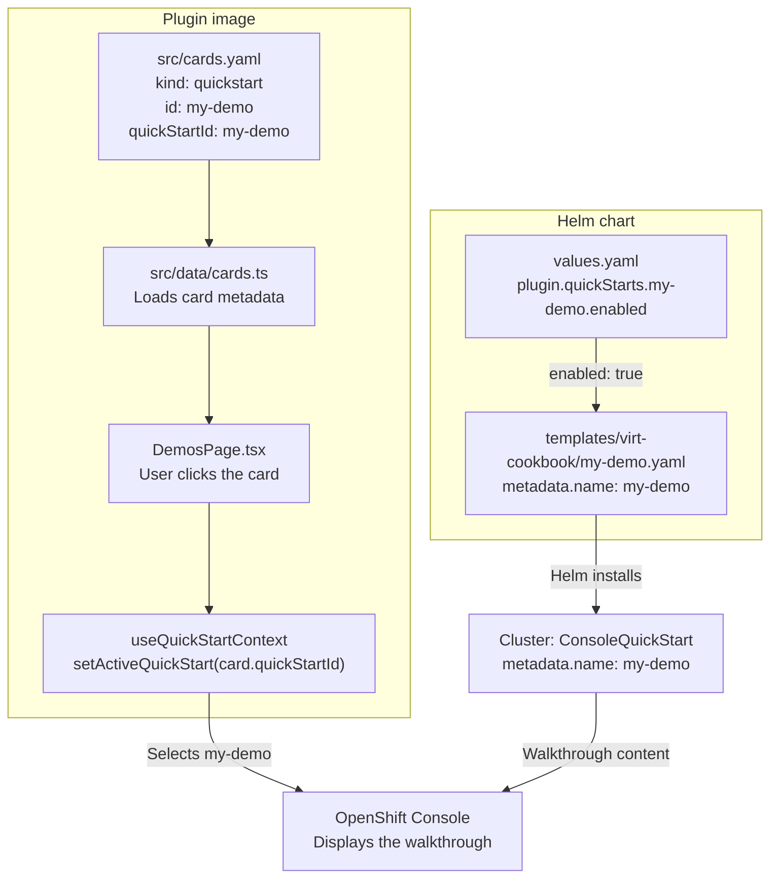

# Create a ConsoleQuickStart demo

This guide covers repository wiring. Use the existing ConsoleQuickStart documentation
for the CR schema and walkthrough content.

## How it connects

The plugin supplies a launch card; OpenShift Console displays the walkthrough from
an installed `ConsoleQuickStart` CR.



| Piece                | Location                                                                                  | Role                                                                                       |
| -------------------- | ----------------------------------------------------------------------------------------- | ------------------------------------------------------------------------------------------ |
| Card registry        | [`src/cards.yaml`](src/cards.yaml)                                                        | `kind: quickstart` selects the launch behavior; `quickStartId` identifies the CR.          |
| Card type and loader | [`src/data/cards.ts`](src/data/cards.ts)                                                  | Loads the registry into the plugin bundle as `DemoCard[]`.                                 |
| Launch handler       | [`src/components/DemosPage.tsx`](src/components/DemosPage.tsx)                            | Calls `setActiveQuickStart?.(card.quickStartId)` through the SDK's `useQuickStartContext`. |
| CR templates         | [`templates/virt-cookbook/`](charts/partner-labs-console-plugin/templates/virt-cookbook/) | Helm installs the VM walkthrough resources.                                                |
| Install switches     | [`values.yaml`](charts/partner-labs-console-plugin/values.yaml)                           | `plugin.quickStarts.<name>.enabled` controls whether each CR is rendered.                  |

**Use one name for all four identifiers:** the card's `id`, its `quickStartId`,
the manifest filename `<name>.yaml`, and the CR's `metadata.name`. Use that same
name for the Helm switch `plugin.quickStarts.<name>.enabled`.

For example, `create-vm-web-console` is both card identifiers, the filename is
`create-vm-web-console.yaml`, and the CR's `metadata.name` is
`create-vm-web-console`. This is the repository naming convention; the SDK launch
itself resolves the CR through `quickStartId`. Card IDs must also be unique across
all card kinds, including cookbook cards.

The card title and CR's `spec.displayName` are separate: the first appears in the
gallery, the second in the Console walkthrough. A QuickStart card needs no new
route, exposed module, or cookbook content file.

## Add a demo

1. Copy an existing CR template, such as
   [`vm-templates.yaml`](charts/partner-labs-console-plugin/templates/virt-cookbook/vm-templates.yaml).
   For a VM demo, save it as `templates/virt-cookbook/my-demo.yaml`. Set
   `metadata.name` and the Helm condition to `my-demo`, then replace the walkthrough content.
   Preserve the chart label helper. For `my-demo`, the condition is:

   ```gotemplate
   {{- if (index .Values.plugin.quickStarts "my-demo").enabled }}
   ```

   Keep the closing `{{- end }}`. The CR is cluster scoped; omit `metadata.namespace`.

2. Add its install switch under `plugin.quickStarts` in `values.yaml`:

   ```yaml
   my-demo:
     enabled: true
   ```

3. Append a unique card to `src/cards.yaml`:

   ```yaml
   - id: my-demo
     kind: quickstart
     title: My demo
     body: Follow a guided walkthrough of my demo.
     quickStartId: my-demo
   ```

## Ship and verify

Card metadata ships in the plugin image; CR content and install switches ship in
the Helm chart. Rebuild and deploy the image for card changes, and upgrade the
Helm release for CR changes using the [deployment instructions](README.md#deploy).
Running `yarn start` alone does not install the CR on your development cluster.

Render the new template and confirm the installed resource:

```sh
helm template partner-labs-console-plugin charts/partner-labs-console-plugin \
  --set plugin.image=quay.io/my-repository/partner-labs-console-plugin:latest \
  --show-only templates/virt-cookbook/my-demo.yaml
oc get consolequickstart my-demo
```

Add the card ID and CR name to the parameterized launch test in
[`DemosPage.spec.tsx`](src/components/DemosPage.spec.tsx). Add an opening check
in [`card-page.spec.ts`](integration-tests/tests/card-page.spec.ts), following
the existing QuickStart tests: click `card-action-my-demo`, then assert
the walkthrough heading and initial content. Run `yarn test` and verify the card
at `/partner-labs-demos` against a cluster with the CR installed.

Setting `plugin.quickStarts.my-demo.enabled=false` omits the CR but leaves its
card in the bundle. The gallery does not check whether the CR exists. If a card
does not open its walkthrough, check the installed CR name, `quickStartId`, and
the Helm switch first.
